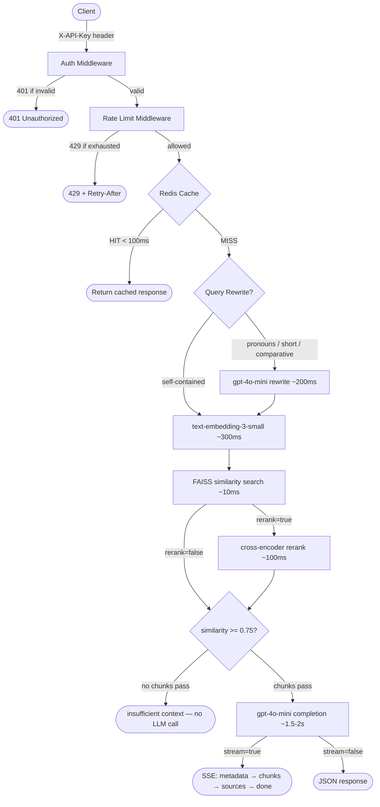

# RAG LLM Semantic Search API

Namespace-isolated RAG API with semantic caching, async ingestion, SSE streaming, and optional cross-encoder re-ranking.


## What This Is

This system ingests PDF and plain-text documents into namespaced FAISS indexes,
retrieves semantically relevant chunks for a user query, and generates grounded
answers with source attribution. It keeps multi-turn session history in Redis,
rewrites ambiguous follow-up questions when context is required, and returns
latency and cache metadata with every response.

The architecture stays single-node by design. FAISS provides an in-process
vector store with no external infrastructure, Redis handles answer caching,
session state, job state, API keys, and rate buckets, and OpenAI provides both
embeddings via `text-embedding-3-small` and completions via `gpt-4o-mini`. The
retrieval path uses two stages when requested: FAISS fetches the candidate set,
and `cross-encoder/ms-marco-MiniLM-L-6-v2` optionally re-ranks those candidates
before the similarity threshold filters final context.

What makes the system production-grade is the discipline around failure modes
and runtime behavior. All external I/O stays async, CPU-bound work moves off
the event loop, configuration fails fast at startup, logs are structured for
machine parsing, API key auth and token-bucket rate limiting run as middleware,
cache hits bypass the expensive path in under 100ms, and SSE streaming emits a
documented four-event protocol for cold responses.

## Architecture



### Request Flow Latency Budget

| Step | Latency | Notes |
| --- | --- | --- |
| Auth + rate limit check | ~10ms | Redis lookup + token bucket |
| Cache check | ~5ms | SHA256 embedding key lookup |
| Query rewrite (if fired) | ~200ms | Only on pronoun/short/comparative queries |
| Embedding | ~300ms | `text-embedding-3-small` via `AsyncOpenAI` |
| FAISS search | ~10ms | In-memory, CPU-bound via `ThreadPoolExecutor` |
| Cross-encoder rerank | ~100ms | Optional. `ms-marco-MiniLM-L-6-v2` on CPU |
| LLM completion | ~1.5-2s | `gpt-4o-mini`, the dominant bottleneck |
| Total cold (no rerank) | ~2-2.5s | End to end |
| Total cold (with rerank) | ~2.3-2.8s | End to end |
| Cached response | <100ms | Full pipeline bypassed |

## Key Design Decisions

| Decision | Choice | Rejected | Rationale |
| --- | --- | --- | --- |
| Vector store | FAISS (faiss-cpu) | Qdrant, Pinecone | Zero infra overhead. Single-node containerised deployment. Abstraction layer makes migration to Qdrant a one-file change. |
| PDF parsing | pymupdf (fitz) | PyPDF2, pdfplumber | Handles multi-column layouts and tables. Fastest of all candidates. |
| Embedding model | text-embedding-3-small | ada-002, large | Best cost/quality ratio at 1536 dims. |
| Completion model | gpt-4o-mini | gpt-4o, gpt-3.5 | 128k context window. Low cost. Sufficient quality. Keeps latency budget defensible. |
| Cache key | SHA256 of rounded embedding | Exact query string hash | Semantically similar queries hit the same cache entry. Rounding to 2dp trades minimal precision for higher hit rate. |
| Re-ranking | cross-encoder/ms-marco-MiniLM-L-6-v2 | LLM-based rerank, Cohere | 22M params. ~50-100ms CPU inference. Ships in Docker image. No external API cost. |
| Streaming | SSE with 4 event types | WebSocket, polling | Stateless HTTP. No connection upgrade. Cache hits return normally - no fake streaming. |
| Rate limiting | Token bucket via Redis Lua | Fixed window, per-IP | Atomic via Lua script - prevents race condition on concurrent requests. Per key_id not per IP. |

## API Reference

#### POST /ingest
Queues one or more files for background ingestion into a namespace.

Request

```http
POST /ingest
X-API-Key: <plaintext_api_key>
Content-Type: multipart/form-data

files=@report.pdf
files=@notes.txt
namespace=finance_docs
```

Response

```json
{
  "job_id": "uuid4",
  "status": "queued",
  "file_count": 2,
  "namespace": "finance_docs"
}
```

#### GET /ingest/{job_id}
Returns ingestion job status, counts, and terminal error metadata.

Request

```http
GET /ingest/{job_id}
X-API-Key: <plaintext_api_key>
```

Response

```json
{
  "job_id": "...",
  "status": "queued|processing|done|failed",
  "chunks_indexed": 142,
  "files_processed": 2,
  "errors": [],
  "completed_at": "ISO8601|null"
}
```

#### POST /query
Runs the full RAG pipeline and returns either JSON or SSE depending on
`stream`.

Request

```json
{
  "query": "What about the third risk?",
  "namespace": "finance_docs",
  "session_id": null,
  "top_k": 5,
  "rerank": true,
  "stream": true
}
```

JSON response (`stream=false` or cache hit)

```json
{
  "answer": "...",
  "session_id": "uuid4",
  "sources": [
    {
      "file": "report.pdf",
      "page": 4,
      "chunk_index": 12,
      "score": 0.91
    }
  ],
  "cached": false,
  "reranked": true,
  "query_rewritten": true,
  "original_query": "What about the third risk?",
  "rewritten_query": "What about the third key risk in the financial report?",
  "latency_ms": 1842
}
```

SSE response (`stream=true`, cache miss)

```text
event: metadata
data: {"session_id": "uuid4", "cached": false, "reranked": true, "query_rewritten": true, "rewritten_query": "..."}

event: chunk
data: {"token": "The "}

event: sources
data: [{"file": "report.pdf", "page": 4, "chunk_index": 12, "score": 0.91}]

event: done
data: {"latency_ms": 1842}
```

#### DELETE /session/{session_id}
Deletes the Redis-backed conversation window for a session.

Request

```http
DELETE /session/{session_id}
X-API-Key: <plaintext_api_key>
```

Response

```json
{
  "deleted": true,
  "session_id": "uuid4"
}
```

#### POST /admin/keys
Provisions a new API key and returns the plaintext value once.

Request

```http
POST /admin/keys
X-Admin-Secret: <admin_secret>
Content-Type: application/json

{
  "name": "test-client"
}
```

Response

```json
{
  "key_id": "uuid4",
  "key": "rag_<64-char-hex>",
  "name": "test-client",
  "created_at": "ISO8601"
}
```

#### GET /admin/keys
Lists API key metadata without ever returning stored key values.

Request

```http
GET /admin/keys
X-Admin-Secret: <admin_secret>
```

Response

```json
{
  "keys": [
    {
      "key_id": "...",
      "name": "test-client",
      "created_at": "...",
      "last_used_at": "..."
    }
  ]
}
```

#### DELETE /admin/keys/{key_id}
Revokes a provisioned API key by deleting its Redis record.

Request

```http
DELETE /admin/keys/{key_id}
X-Admin-Secret: <admin_secret>
```

Response

```json
{
  "revoked": true,
  "key_id": "uuid4"
}
```

#### GET /health
Reports process status, Redis connectivity, loaded namespaces, and reranker
readiness.

Request

```http
GET /health
```

Response

```json
{
  "status": "ok",
  "redis": "ok",
  "faiss_namespaces_loaded": 3,
  "reranker_loaded": true,
  "version": "1.1.0"
}
```

## Project Structure

```text
rag-llm-semantic-search-api/
├── app/
│   ├── api/
│   │   ├── routes/
│   │   │   ├── ingest.py          # Upload handler + background job dispatch
│   │   │   ├── query.py           # RAG query + SSE streaming + session management
│   │   │   ├── admin.py           # Key provisioning, revocation, listing
│   │   │   └── health.py          # Health check (Redis + FAISS + reranker status)
│   │   └── dependencies.py        # FastAPI Depends() for shared services
│   ├── core/
│   │   ├── config.py              # Pydantic BaseSettings - all config from .env
│   │   └── logging.py             # Structured JSON logging (production-ready)
│   ├── middleware/
│   │   ├── auth.py                # X-API-Key extraction, SHA256, Redis lookup, 401
│   │   └── rate_limit.py          # Token bucket per key_id, 429 + Retry-After
│   ├── services/
│   │   ├── document_loader.py     # PDF (pymupdf) + TXT -> list[str] pages
│   │   ├── chunker.py             # Recursive splitter -> list[ChunkMetadata]
│   │   ├── embeddings.py          # Async batch embed + hash-based dedup
│   │   ├── vector_store.py        # FAISS: namespace, lock, preload, search
│   │   ├── reranker.py            # CrossEncoder preload + async rerank
│   │   ├── cache.py               # Redis: answers, sessions, jobs, hashes, keys, buckets
│   │   ├── query_rewriter.py      # Heuristic gate + LLM rewrite
│   │   └── rag_pipeline.py        # Orchestrates: rewrite->embed->search->rerank->stream
│   ├── models/
│   │   └── schemas.py             # All Pydantic v2 request/response models
│   └── main.py                    # App factory, lifespan, middleware order, router mount
├── tests/
│   ├── conftest.py                # Fixtures: mock Redis, mock OpenAI, tmp FAISS, mock reranker
│   ├── test_auth.py               # Key provision, revoke, invalid key, timing safety
│   ├── test_rate_limit.py         # Bucket exhaustion, Retry-After header, reset
│   ├── test_ingest.py             # Upload, job status, dedup on re-ingest
│   ├── test_query.py              # Cold, cached, multi-turn, threshold fallback, rerank
│   ├── test_streaming.py          # SSE event order, cache-hit non-stream behaviour
│   ├── test_rewriter.py           # Heuristic gate unit tests
│   └── test_cache.py              # Redis key patterns, TTL, session CRUD
├── docker-compose.yml             # Services: app (port 8000), redis (port 6379)
├── Dockerfile                     # Multi-stage: builder + slim runtime, non-root user
├── .env.example                   # All required env vars with comments
├── requirements.txt               # Pinned versions
└── README.md                      # Setup, usage, architecture summary, first query < 5min
```

## Getting Started

Prerequisites:

- Docker and Docker Compose
- An OpenAI API key

1. Clone the repo.

```bash
git clone <repo-url>
cd rag-llm-semantic-search-api
```

2. Copy `.env.example` to `.env` and fill in `OPENAI_API_KEY` and
   `ADMIN_SECRET`.

```bash
cp .env.example .env
# Generate a strong ADMIN_SECRET value:
openssl rand -hex 32
# Copy the output into .env as ADMIN_SECRET=<output>
```

3. Start the stack.

```bash
docker compose up --build
```

4. Provision an API key via `POST /admin/keys`.

```bash
curl -X POST http://localhost:8000/admin/keys \
  -H "Content-Type: application/json" \
  -H "X-Admin-Secret: <admin_secret>" \
  -d '{"name":"local-dev"}'
```

5. Ingest a document via `POST /ingest`.

```bash
curl -X POST http://localhost:8000/ingest \
  -H "X-API-Key: <plaintext_api_key_from_step_4>" \
  -F "namespace=finance_docs" \
  -F "files=@./docs/report.pdf"
```

6. Query via `POST /query`.

```bash
curl -X POST http://localhost:8000/query \
  -H "Content-Type: application/json" \
  -H "X-API-Key: <plaintext_api_key_from_step_4>" \
  -d '{"query":"What are the top risks?","namespace":"finance_docs","stream":false}'
```

```bash
curl -N -X POST http://localhost:8000/query \
  -H "Content-Type: application/json" \
  -H "Accept: text/event-stream" \
  -H "X-API-Key: <plaintext_api_key_from_step_4>" \
  -d '{"query":"What are the top risks?","namespace":"finance_docs","stream":true,"rerank":true}'
```

## Development Setup (Without Docker)

1. Create a virtual environment and activate it.

```bash
python -m venv .venv && source .venv/bin/activate
# Windows: .venv\Scripts\activate
```

2. Install dependencies.

```bash
pip install -r requirements.txt
```

3. Start Redis locally.

```bash
docker run -p 6379:6379 redis:7-alpine
```

4. Copy `.env.example` to `.env` and fill in required values.

```bash
cp .env.example .env
```

5. Start the API.

```bash
uvicorn app.main:app --reload --port 8000
```

### Running Tests

```bash
pytest tests/ -v --cov=app --cov-report=term-missing
```

Coverage target: >= 80% on `app/services/` and `app/middleware/`.

## Redis Key Schema

| Key Pattern | Type | TTL | Purpose |
| --- | --- | --- | --- |
| `cache:answer:{sha256_of_rounded_embedding}` | String (JSON) | 3600s | Semantic answer cache. Key is SHA256 of query embedding rounded to 2dp. Hit returns non-streamed response. |
| `session:{session_id}` | String (JSON) | 3600s | Sliding window of last 6 turns. JSON array of `{role, content}` objects. TTL refreshed on each access. |
| `job:{job_id}` | String (JSON) | 86400s | Ingestion job state: status, `chunks_indexed`, `files_processed`, `errors`, `completed_at`. |
| `doc:hash:{content_hash}` | String | No TTL | Registry of ingested content hashes. Prevents re-embedding identical chunks on re-ingest. |
| `api_key:{sha256_of_key}` | Hash (JSON) | No TTL | API key record: `key_id`, `name`, `created_at`, `last_used_at`. Plaintext key never stored. Deleted on revocation. |
| `rate:{key_id}` | String (JSON) | 120s | Token bucket state: `{tokens, last_refill}`. TTL auto-cleans inactive clients. 100 tokens/min capacity. |

## Limitations and Scope

This system is explicit about what it does and what it does not do. The
architecture targets a single-node, containerised deployment with clear service
boundaries, not a horizontally scaled multi-tenant platform.

- Single-node only. FAISS does not support distributed writes. Migration path:
  swap `vector_store.py` for Qdrant.
- No multi-tenancy. Namespace isolation is not multi-tenancy. True
  multi-tenancy requires per-tenant auth and data guarantees.
- API key rotation is manual. No automated expiry or rotation schedule in
  v1.1.
- No distributed tracing. Structured JSON logs per request but no
  OpenTelemetry instrumentation.
- Cache hits are never streamed. A cached response returns in <100ms as
  standard JSON regardless of `stream=true`.

## Tech Stack

| Component | Technology | Version |
| --- | --- | --- |
| Web Framework | `fastapi` | `0.115.5` |
| Web Framework | `uvicorn[standard]` | `0.32.1` |
| Web Framework | `python-multipart` | `0.0.12` |
| AI/ML | `openai` | `1.57.0` |
| AI/ML | `tiktoken` | `0.8.0` |
| AI/ML | `sentence-transformers` | `3.3.1` |
| Vector Store | `faiss-cpu` | `1.9.0` |
| Caching | `redis` | `5.2.0` |
| Document Processing | `pymupdf` | `1.24.14` |
| Utilities | `pydantic` | `2.10.3` |
| Utilities | `pydantic-settings` | `2.6.1` |
| Utilities | `python-json-logger` | `3.2.0` |
| Utilities | `httpx` | `0.28.1` |
